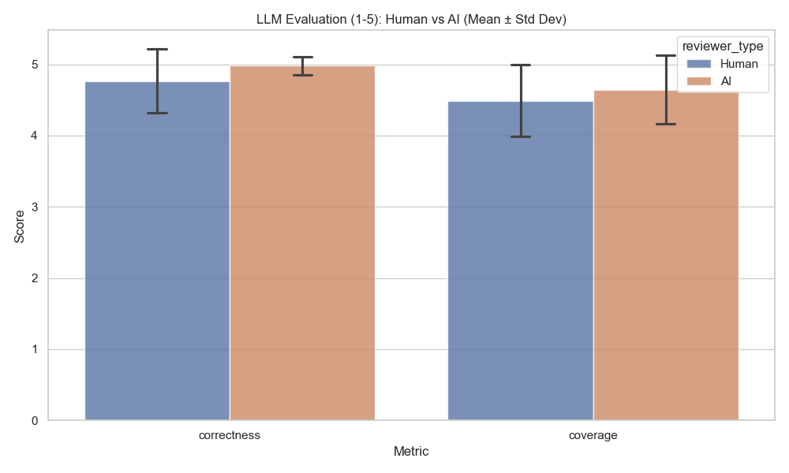
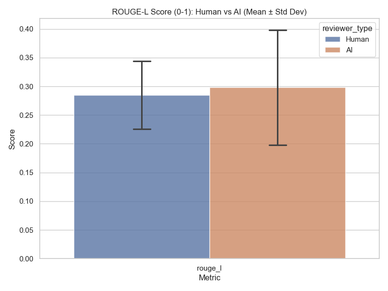
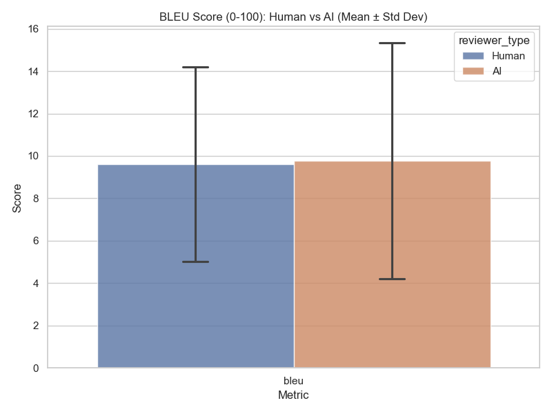
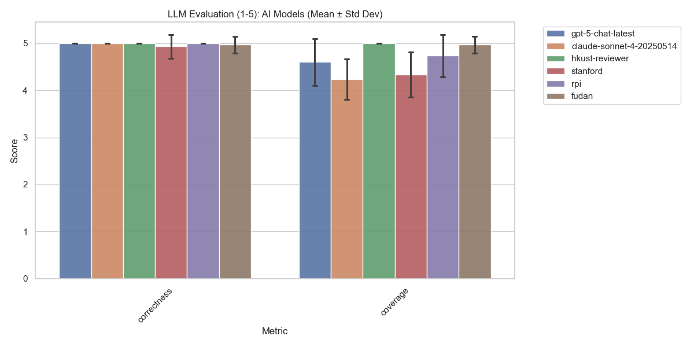
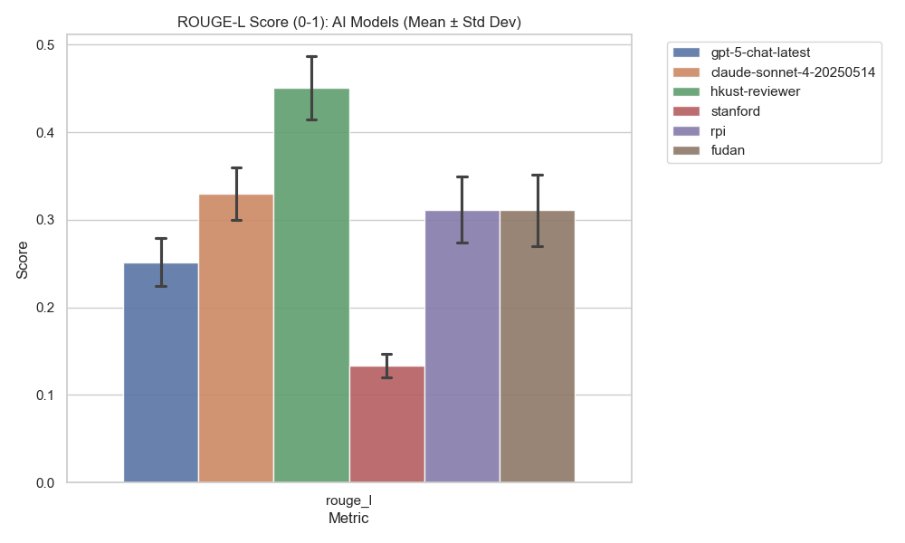
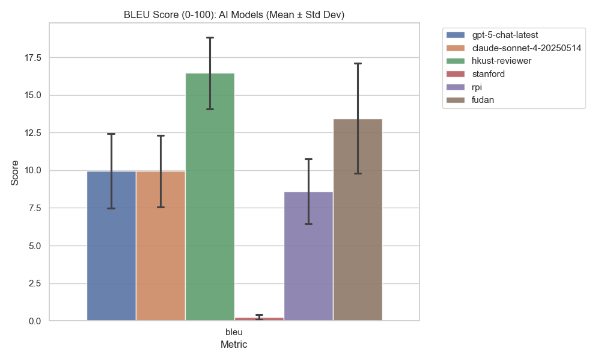

# Harmonization Alignment Evaluation

This report evaluates the semantic alignment between original reviews and their harmonized versions.

## Methodology
We used a multi-tiered approach:
1. **LLM Eval (gpt-5.2)**: Scored Correctness and Coverage (1-5).
2. **Embedding Similarity**: Cosine similarity using `text-embedding-3-large`.
3. **ROUGE-L**: Measures longest common subsequence overlap.
4. **BLEU**: Measures n-gram overlap precision.

## Scoring Prompt
The following prompt was used for LLM evaluation:

```text

You are an expert reviewer evaluator.
Compare the Original Review and the Harmonized Review below.
The Harmonized Review is a rewriting of the Original.

Assess semantic alignment on two axes:
1. Correctness (1-5): Is the information factually preserving the original? 5 = Perfect preservation.
2. Coverage (1-5): Does it cover all key points from the original? 5 = covers everything.

Original Review:
{original}

Harmonized Review:
{harmonized}

Return a JSON object with keys "correctness" and "coverage" (integers 1-5).

```

## Overall Statistics
Mean and Standard Deviation for each metric.

|                   |   AI (Mean) |   AI (Std) |   Human (Mean) |   Human (Std) |
|:------------------|------------:|-----------:|---------------:|--------------:|
| correctness       |       4.983 |      0.128 |          4.767 |         0.451 |
| coverage          |       4.644 |      0.480 |          4.489 |         0.503 |
| cosine_similarity |       0.897 |      0.044 |          0.838 |         0.022 |
| rouge_l           |       0.298 |      0.100 |          0.285 |         0.059 |
| bleu              |       9.772 |      5.565 |          9.594 |         4.590 |

### Visualizations (Overall)
#### LLM Scores (1-5)


#### Cosine Similarity (0-1)


#### ROUGE-L (0-1)


#### BLEU (0-100)


## AI Model Performance
|                   |   claude-sonnet-4-20250514 |   fudan |   gpt-5-chat-latest |   hkust-reviewer |   rpi |   stanford |
|:------------------|---------------------------:|--------:|--------------------:|-----------------:|------:|-----------:|
| correctness       |                      5.000 |   4.967 |               5.000 |            5.000 | 5.000 |      4.933 |
| coverage          |                      4.233 |   4.967 |               4.600 |            5.000 | 4.733 |      4.333 |
| cosine_similarity |                      0.873 |   0.932 |               0.895 |            0.946 | 0.916 |      0.822 |
| rouge_l           |                      0.330 |   0.311 |               0.251 |            0.450 | 0.312 |      0.134 |
| bleu              |                      9.945 |  13.443 |               9.950 |           16.452 | 8.607 |      0.237 |

### Visualizations (By Model)
#### LLM Scores (1-5)


#### Cosine Similarity (0-1)


#### ROUGE-L (0-1)


#### BLEU (0-100)


