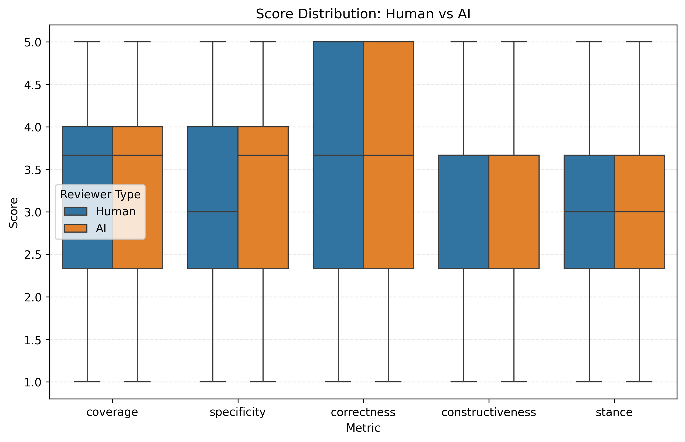
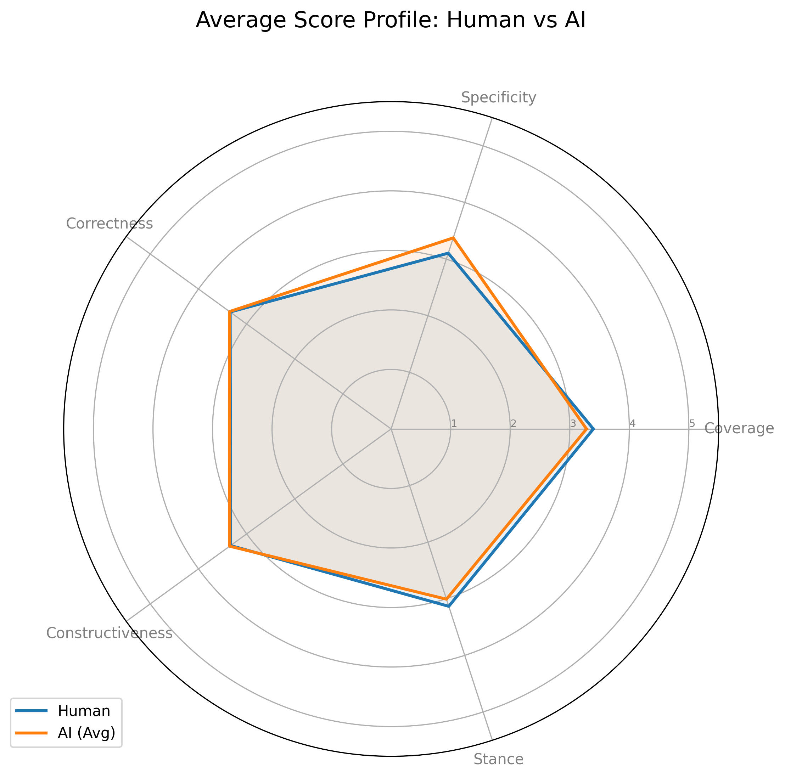
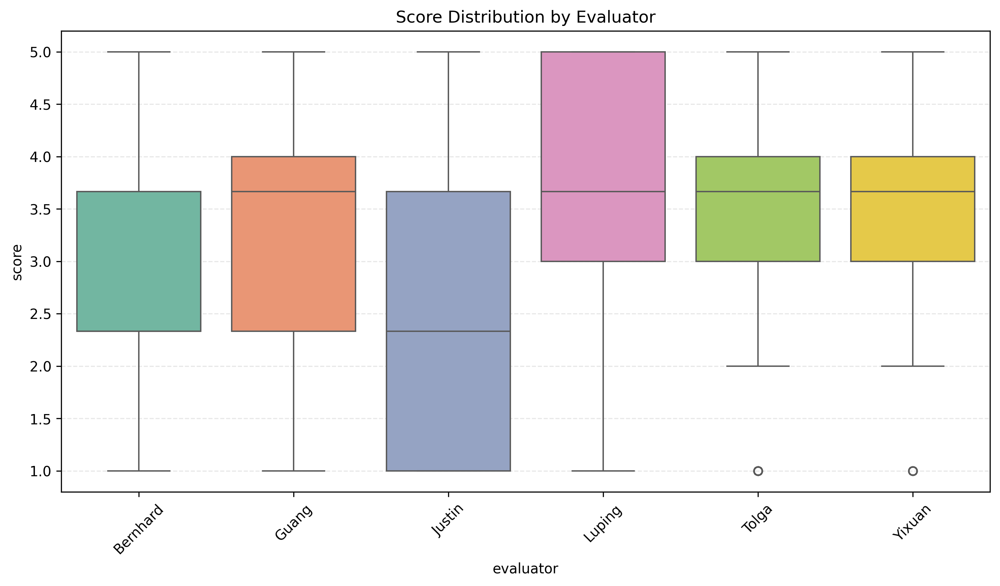
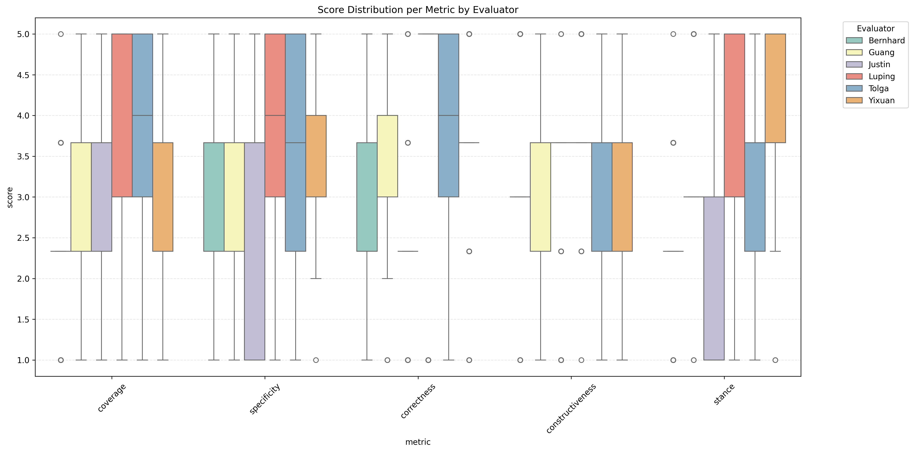
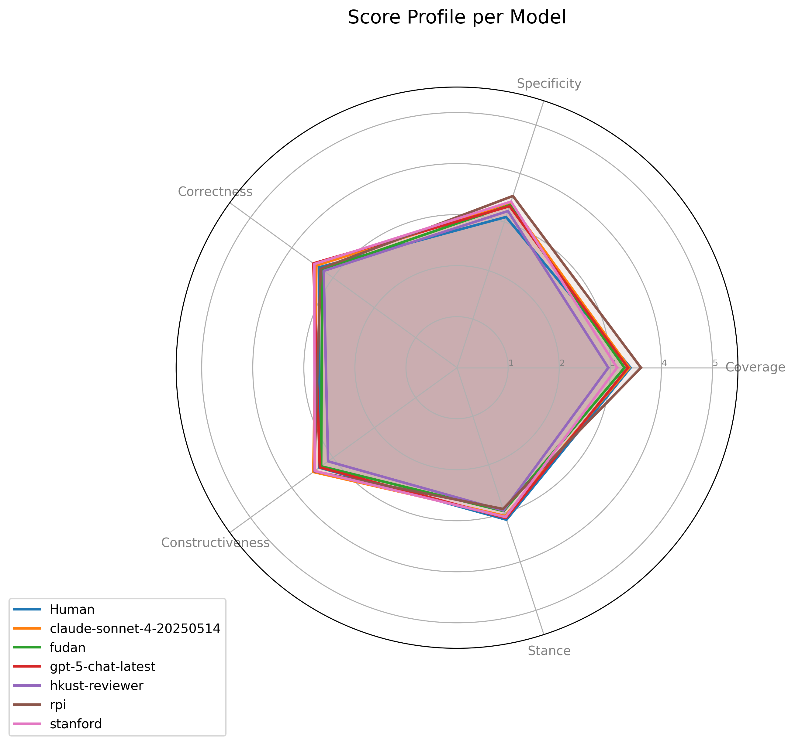
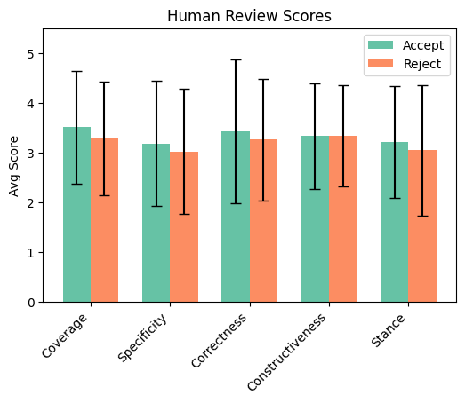
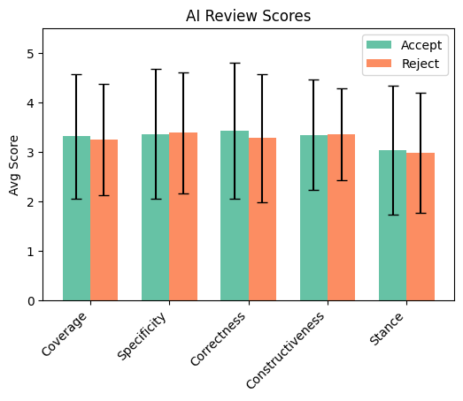

# AI Reviewer Evaluation Report
**Date:** Automated Analysis

## Introduction
This report presents a comprehensive evaluation of AI reviewers compared to human performance.

## Score Statistics

### Score Distributions

### Per-Evaluator Statistics

### Per-Evaluator per Metric Statistics

## Statistical Significance Tests

### Methodology
We confirm performance differences using Mann-Whitney U (unpaired), Wilcoxon Signed-Rank (paired), and assess variance equality with Levene's Test. Effect size is measured by Cliff's Delta.

### Global Analysis (Human vs All AI)
| Metric           | MW U (p)   |   Wilcoxon (p) |   Levene (p) |   Cliff's Delta |
|:-----------------|:-----------|---------------:|-------------:|----------------:|
| Coverage         | 0.3066     |         0.1812 |       0.3899 |          -0.053 |
| Specificity      | 0.0177*    |         0.2872 |       0.1653 |           0.122 |
| Correctness      | 0.8575     |         0.3564 |       0.869  |           0.009 |
| Constructiveness | 0.6904     |         0.9165 |       0.578  |           0.02  |
| Stance           | 0.3405     |         0.299  |       0.4229 |          -0.049 |

### Per-Model Analysis

#### Model: claude-sonnet-4-20250514
| Metric           |   MW U (p) |   Wilcoxon (p) |   Levene (p) |   Cliff's Delta |
|:-----------------|-----------:|---------------:|-------------:|----------------:|
| Coverage         |     0.8356 |         0.5397 |       0.7947 |          -0.018 |
| Specificity      |     0.1441 |         0.3737 |       0.3821 |           0.124 |
| Correctness      |     0.796  |         0.9372 |       0.9496 |           0.022 |
| Constructiveness |     0.3895 |         0.3755 |       0.3187 |           0.07  |
| Stance           |     0.6479 |         0.4789 |       0.9268 |          -0.039 |

#### Model: fudan
| Metric           |   MW U (p) |   Wilcoxon (p) |   Levene (p) |   Cliff's Delta |
|:-----------------|-----------:|---------------:|-------------:|----------------:|
| Coverage         |     0.3513 |         0.2334 |       0.4661 |          -0.078 |
| Specificity      |     0.1944 |         0.372  |       0.1419 |           0.11  |
| Correctness      |     0.6317 |         0.4241 |       0.974  |          -0.041 |
| Constructiveness |     0.8    |         0.5965 |       0.9004 |          -0.021 |
| Stance           |     0.3754 |         0.2081 |       0.4644 |          -0.075 |

#### Model: gpt-5-chat-latest
| Metric           |   MW U (p) |   Wilcoxon (p) |   Levene (p) |   Cliff's Delta |
|:-----------------|-----------:|---------------:|-------------:|----------------:|
| Coverage         |     0.9149 |         0.5969 |       0.8414 |          -0.009 |
| Specificity      |     0.1935 |         0.5592 |       0.9736 |           0.11  |
| Correctness      |     0.4943 |         0.6553 |       0.2176 |           0.058 |
| Constructiveness |     0.9122 |         0.7193 |       0.9754 |           0.009 |
| Stance           |     0.9264 |         0.6093 |       0.4107 |           0.008 |

#### Model: hkust-reviewer
| Metric           | MW U (p)   | Wilcoxon (p)   |   Levene (p) |   Cliff's Delta |
|:-----------------|:-----------|:---------------|-------------:|----------------:|
| Coverage         | 0.0279*    | 0.0226*        |       0.878  |          -0.185 |
| Specificity      | 0.5086     | 0.8930         |       0.8963 |           0.056 |
| Correctness      | 0.6658     | 0.3593         |       0.6902 |          -0.037 |
| Constructiveness | 0.2996     | 0.2151         |       0.384  |          -0.085 |
| Stance           | 0.4898     | 0.2056         |       0.0588 |          -0.058 |

#### Model: rpi
| Metric           | MW U (p)   |   Wilcoxon (p) |   Levene (p) |   Cliff's Delta |
|:-----------------|:-----------|---------------:|-------------:|----------------:|
| Coverage         | 0.2350     |         0.283  |       0.3523 |           0.1   |
| Specificity      | 0.0251*    |         0.1047 |       0.2377 |           0.19  |
| Correctness      | 0.9285     |         0.5547 |       0.5892 |          -0.008 |
| Constructiveness | 0.2958     |         0.3909 |       0.6874 |           0.085 |
| Stance           | 0.2676     |         0.2334 |       0.8541 |          -0.093 |

#### Model: stanford
| Metric           |   MW U (p) |   Wilcoxon (p) | Levene (p)   |   Cliff's Delta |
|:-----------------|-----------:|---------------:|:-------------|----------------:|
| Coverage         |     0.1361 |         0.1118 | 0.3978       |          -0.125 |
| Specificity      |     0.0868 |         0.1929 | 0.0212*      |           0.145 |
| Correctness      |     0.4724 |         0.7546 | 0.6364       |           0.061 |
| Constructiveness |     0.463  |         0.6983 | 0.1395       |           0.06  |
| Stance           |     0.6514 |         0.7448 | 0.3161       |          -0.038 |

## Turing Test Analysis (AI Detection)
Evaluators were asked to guess if the review was written by AI or Human. We present the confusion matrices below.
| Evaluator   |   Accuracy |   Precision |   Recall |       F1 |
|:------------|-----------:|------------:|---------:|---------:|
| Bernhard    |   0.666667 |    0.666667 | 1        | 0.8      |
| Guang       |   0.377778 |    0.535714 | 0.5      | 0.517241 |
| Justin      |   0.6      |    0.657895 | 0.833333 | 0.735294 |
| Luping      |   0.477778 |    0.740741 | 0.333333 | 0.45977  |
| Tolga       |   0.477778 |    0.666667 | 0.433333 | 0.525253 |
| Yixuan      |   0.566667 |    0.769231 | 0.5      | 0.606061 |
| Overall     |   0.527778 |    0.66055  | 0.6      | 0.628821 |

### Per-Evaluator Confusion Matrices

## Inter-Evaluator Agreement
Cohen's Kappa agreement between evaluators on review scores (discretized).
| Evaluator   | Bernhard   | Guang   | Justin   | Luping   | Tolga   | Yixuan   |
|:------------|:-----------|:--------|:---------|:---------|:--------|:---------|
| Bernhard    | -          | 0.00    | -        | -0.07    | 0.06    | -        |
| Guang       | 0.00       | -       | -0.16    | -0.04    | -       | 0.21     |
| Justin      | -          | -0.16   | -        | -        | 0.04    | -0.07    |
| Luping      | -0.07      | -0.04   | -        | -        | -       | 0.22     |
| Tolga       | 0.06       | -       | 0.04     | -        | -       | 0.07     |
| Yixuan      | -          | 0.21    | -0.07    | 0.22     | 0.07    | -        || Evaluator   | Bernhard   | Guang   | Justin   | Luping   | Tolga   | Yixuan   |
|:------------|:-----------|:--------|:---------|:---------|:--------|:---------|
| Bernhard    | -          | 0.00    | -        | -0.07    | 0.06    | -        |
| Guang       | 0.00       | -       | -0.16    | -0.04    | -       | 0.21     |
| Justin      | -          | -0.16   | -        | -        | 0.04    | -0.07    |
| Luping      | -0.07      | -0.04   | -        | -        | -       | 0.22     |
| Tolga       | 0.06       | -       | 0.04     | -        | -       | 0.07     |
| Yixuan      | -          | 0.21    | -0.07    | 0.22     | 0.07    | -        |

## Breakdown wrt Accepted versus Rejected Papers
Analysis of review characteristics based on the final decision (Accept vs Reject).

### Scores and Differences

**Human Scores (Accept/Reject)**  

**AI Scores (Accept/Reject)**  

### Turing Test Confusion Matrices

### Additional Metrics
**AI Detection Metrics**  

**Dataset Distribution**  

# Appendix: Guide to Interpretations

## Interpreting Box Plots
The box plots in this report visualize the distribution of review scores.
* **Box**: Represents the Interquartile Range (IQR), spanning from the 25th percentile (Q1) to the 75th percentile (Q3). It contains the middle 50% of the data.
* **Median**: The line inside the box marks the median score (50th percentile).
* **Whiskers**: Extend from the box to the most extreme data points that are not considered outliers. Typically, this is 1.5 * IQR.
* **Empty Circles (Outliers)**: Points lying beyond the whiskers are plotted individually as empty circles. These represent outlier scores that are unusually high or low compared to the rest of the distribution.

## Statistical Methodology Details
This section explains the intuition and computation behind the statistical tests used.

### Mann-Whitney U Test
**Intuition**: A non-parametric test for independent samples (e.g., Human vs AI scores across different papers). It assesses whether one group's values are stochastically larger than the other's. It does not assume a normal distribution.
**Computation**: All observations are ranked together. The sum of ranks for each group is calculated. The U statistic is derived from these rank sums, comparing the number of times a value from one group precedes a value from the other.

### Wilcoxon Signed-Rank Test
**Intuition**: A non-parametric paired test used for per-model comparisons where we have matched scores (Human and AI reviewing the *same* paper). It tests if the distribution of differences is symmetric about zero.
**Computation**: Differences between paired scores (d_i = x_H - x_A) are calculated. Absolute differences |d_i| are ranked. Ranks are signed according to the sign of d_i. The test statistic W is the sum of positive ranks.

### Levene's Test
**Intuition**: Tests the null hypothesis that the variances (spread) of the two groups are equal (Homogeneity of Variance).
**Computation**: It performs an Analysis of Variance (ANOVA) on the absolute deviations of scores from their group means (or medians). A significant p-value suggests the groups have different consistency levels.

### Cliff's Delta
**Intuition**: An effect size measure quantifying the magnitude of difference between two groups. It represents the probability that a randomly selected value from one group is greater than one from the other, minus the reverse probability. values range from -1 to +1.
**Computation**:
delta = (#(x_H > x_A) - #(x_H < x_A)) / (n_H * n_A)
where x_H and x_A are scores from Human and AI groups respectively. 
Interpretation: |delta| < 0.147 (Negligible), < 0.33 (Small), < 0.474 (Medium), else (Large).

### Cohen's Kappa
**Intuition**: Measures inter-rater agreement for categorical items, correcting for agreement occurring by chance.
**Computation**:
kappa = (p_o - p_e) / (1 - p_e)
where p_o is the relative observed agreement, and p_e is the hypothetical probability of chance agreement based on marginal frequencies.
