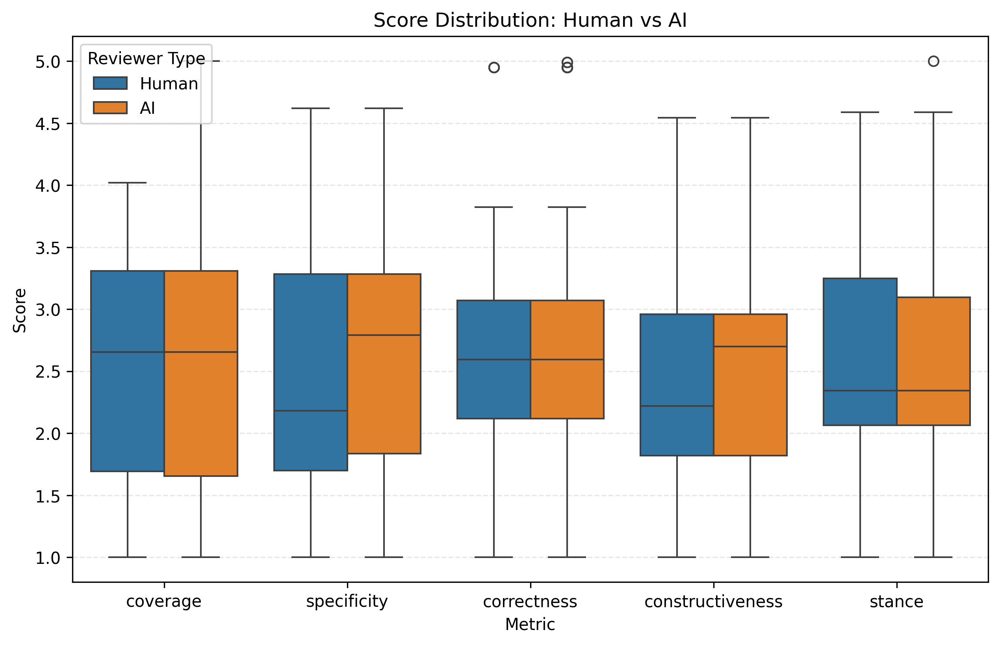
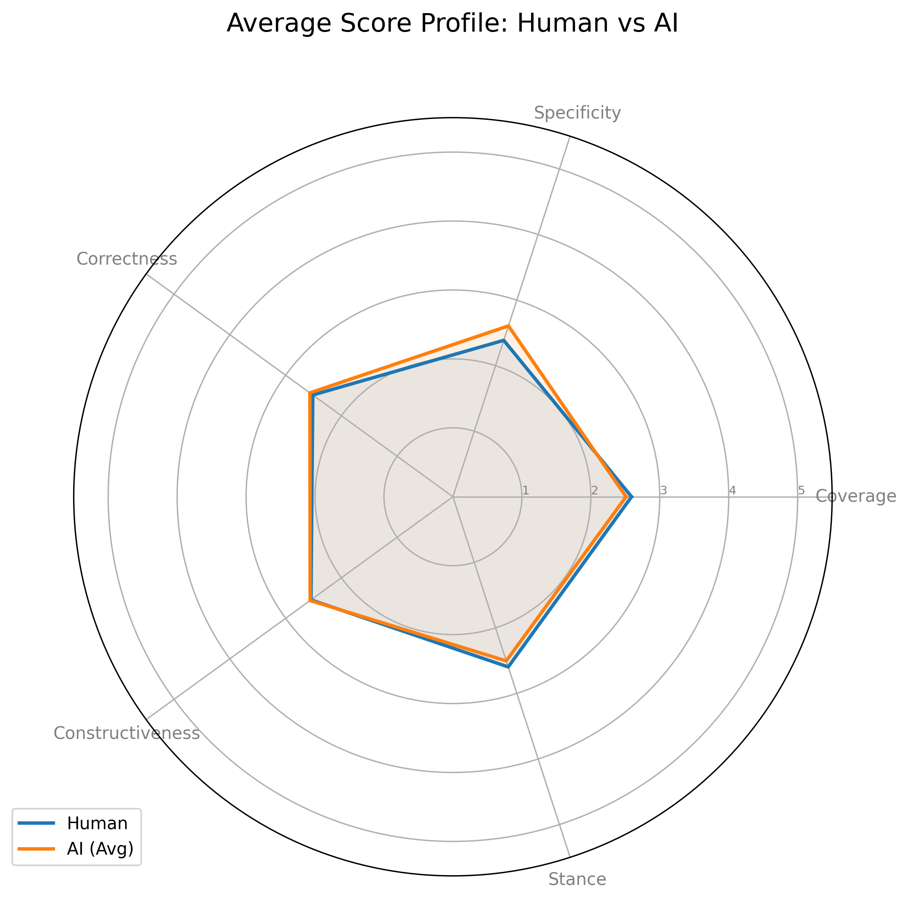
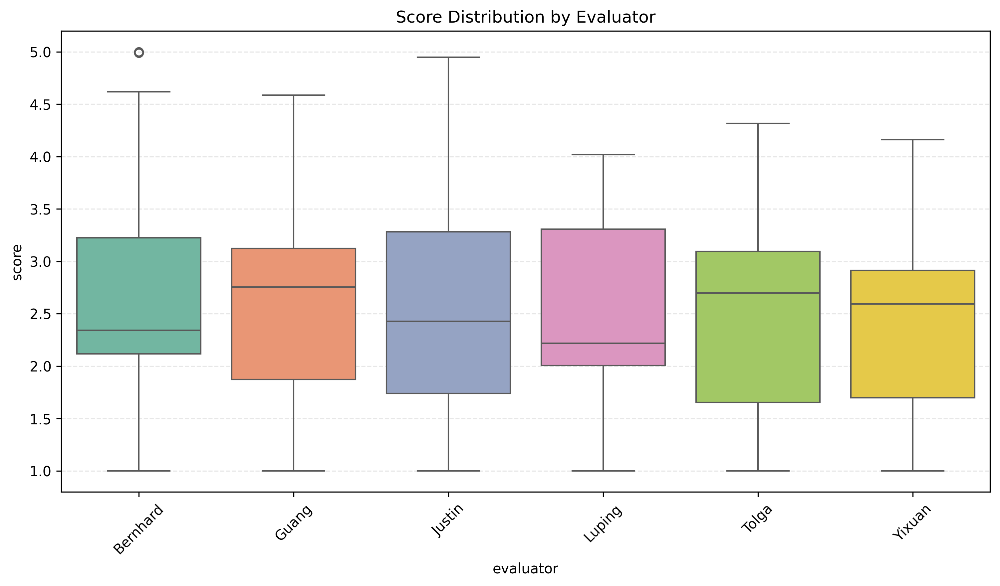
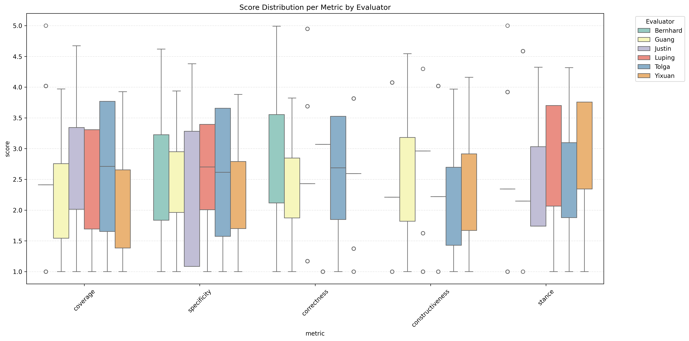
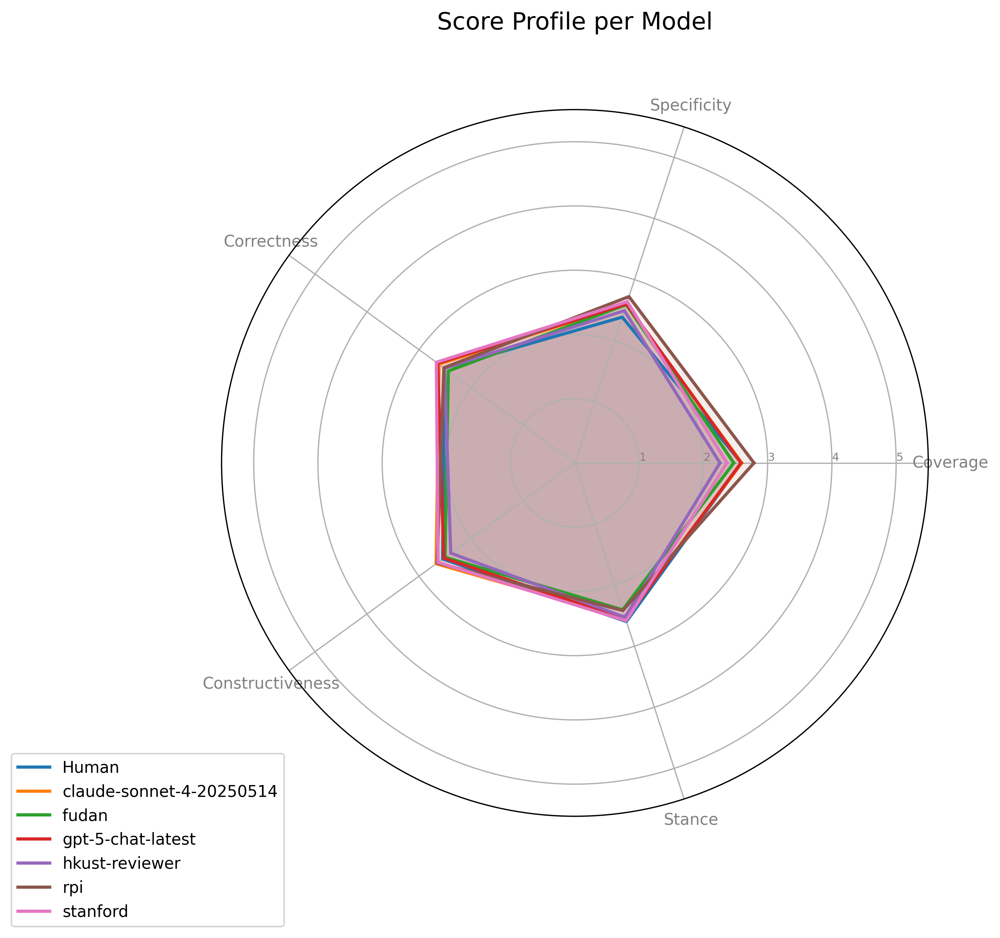
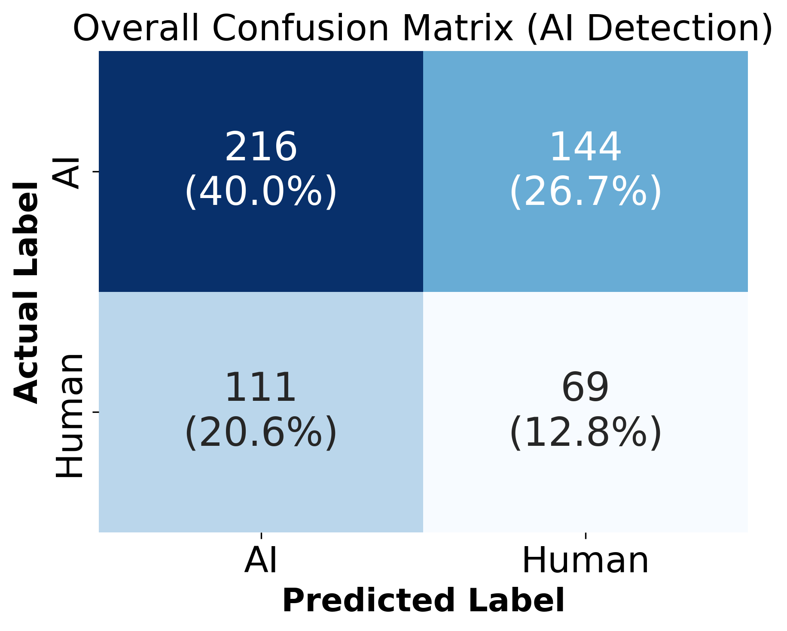
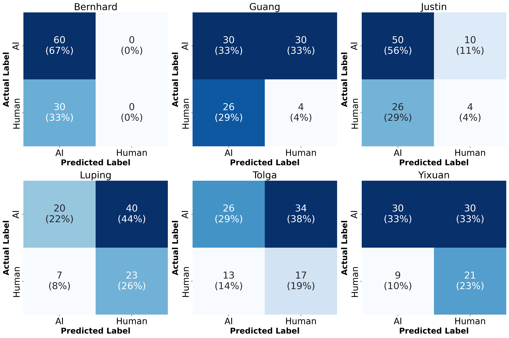
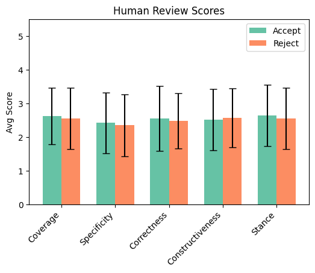
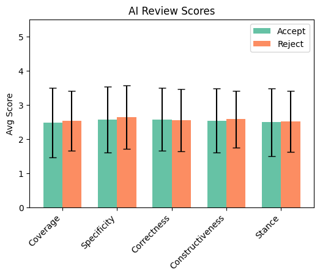
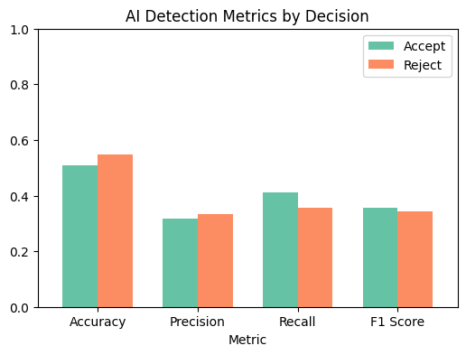

# AI Reviewer Evaluation Report
**Date:** Automated Analysis

## Introduction
This report presents a comprehensive evaluation of AI reviewers compared to human performance.

## Score Statistics

### Score Distributions

### Per-Evaluator Statistics

### Per-Evaluator per Metric Statistics

## Statistical Significance Tests

### Methodology
We confirm performance differences using Mann-Whitney U (unpaired), Wilcoxon Signed-Rank (paired), and assess variance equality with Levene's Test. Effect size is measured by Cliff's Delta.

### Global Analysis (Human vs All AI)
| Metric           | MW U (p)   |   Wilcoxon (p) |   Levene (p) |   Cliff's Delta |
|:-----------------|:-----------|---------------:|-------------:|----------------:|
| Coverage         | 0.4257     |         0.3154 |       0.0888 |          -0.042 |
| Specificity      | 0.0117*    |         0.3046 |       0.881  |           0.133 |
| Correctness      | 0.4954     |         0.6326 |       0.6067 |           0.036 |
| Constructiveness | 0.5667     |         0.9367 |       0.9975 |           0.03  |
| Stance           | 0.3668     |         0.3751 |       0.8857 |          -0.047 |

### Per-Model Analysis

#### Model: claude-sonnet-4-20250514
| Metric           |   MW U (p) |   Wilcoxon (p) |   Levene (p) |   Cliff's Delta |
|:-----------------|-----------:|---------------:|-------------:|----------------:|
| Coverage         |     0.9777 |         0.8441 |       0.7283 |           0.003 |
| Specificity      |     0.1302 |         0.7492 |       0.6723 |           0.13  |
| Correctness      |     0.4365 |         0.6947 |       0.5289 |           0.067 |
| Constructiveness |     0.2614 |         0.2963 |       0.7862 |           0.097 |
| Stance           |     0.8436 |         0.361  |       0.9078 |          -0.017 |

#### Model: fudan
| Metric           |   MW U (p) |   Wilcoxon (p) |   Levene (p) |   Cliff's Delta |
|:-----------------|-----------:|---------------:|-------------:|----------------:|
| Coverage         |     0.3471 |         0.1423 |       0.6293 |          -0.081 |
| Specificity      |     0.1898 |         0.5494 |       0.6125 |           0.113 |
| Correctness      |     0.6484 |         0.4506 |       0.7832 |          -0.039 |
| Constructiveness |     0.842  |         0.9754 |       0.7737 |          -0.017 |
| Stance           |     0.3708 |         0.0734 |       0.3934 |          -0.077 |

#### Model: gpt-5-chat-latest
| Metric           |   MW U (p) |   Wilcoxon (p) |   Levene (p) |   Cliff's Delta |
|:-----------------|-----------:|---------------:|-------------:|----------------:|
| Coverage         |     0.9845 |         0.7646 |       0.2558 |          -0.002 |
| Specificity      |     0.1254 |         0.5295 |       0.6841 |           0.132 |
| Correctness      |     0.3352 |         0.6136 |       0.4886 |           0.083 |
| Constructiveness |     0.9905 |         0.7808 |       0.9468 |           0.001 |
| Stance           |     0.9647 |         0.6004 |       0.8854 |          -0.004 |

#### Model: hkust-reviewer
| Metric           | MW U (p)   | Wilcoxon (p)   | Levene (p)   |   Cliff's Delta |
|:-----------------|:-----------|:---------------|:-------------|----------------:|
| Coverage         | 0.0351*    | 0.0202*        | 0.0339*      |          -0.181 |
| Specificity      | 0.4722     | 0.8503         | 0.1826       |           0.062 |
| Correctness      | 0.9030     | 0.4923         | 0.5603       |          -0.011 |
| Constructiveness | 0.3904     | 0.7538         | 0.6046       |          -0.074 |
| Stance           | 0.5353     | 0.5007         | 0.3936       |          -0.053 |

#### Model: rpi
| Metric           | MW U (p)   |   Wilcoxon (p) |   Levene (p) |   Cliff's Delta |
|:-----------------|:-----------|---------------:|-------------:|----------------:|
| Coverage         | 0.1210     |         0.4776 |       0.0914 |           0.133 |
| Specificity      | 0.0168*    |         0.2015 |       0.7371 |           0.206 |
| Correctness      | 0.9914     |         0.4817 |       0.639  |           0.001 |
| Constructiveness | 0.3183     |         0.6419 |       0.9853 |           0.086 |
| Stance           | 0.2791     |         0.1057 |       0.9523 |          -0.093 |

#### Model: stanford
| Metric           |   MW U (p) |   Wilcoxon (p) |   Levene (p) |   Cliff's Delta |
|:-----------------|-----------:|---------------:|-------------:|----------------:|
| Coverage         |     0.1512 |         0.0842 |       0.7931 |          -0.124 |
| Specificity      |     0.0747 |         0.4609 |       0.2799 |           0.153 |
| Correctness      |     0.1846 |         0.5616 |       0.7711 |           0.114 |
| Constructiveness |     0.3043 |         0.4573 |       0.5177 |           0.088 |
| Stance           |     0.64   |         0.872  |       0.467  |          -0.04  |

## Turing Test Analysis (AI Detection)
Evaluators were asked to guess if the review was written by AI or Human. We present the confusion matrices below.
| Evaluator   |   Accuracy |   Precision |   Recall |       F1 |
|:------------|-----------:|------------:|---------:|---------:|
| Bernhard    |   0.666667 |    0.666667 | 1        | 0.8      |
| Guang       |   0.377778 |    0.535714 | 0.5      | 0.517241 |
| Justin      |   0.6      |    0.657895 | 0.833333 | 0.735294 |
| Luping      |   0.477778 |    0.740741 | 0.333333 | 0.45977  |
| Tolga       |   0.477778 |    0.666667 | 0.433333 | 0.525253 |
| Yixuan      |   0.566667 |    0.769231 | 0.5      | 0.606061 |
| Overall     |   0.527778 |    0.66055  | 0.6      | 0.628821 |

### Per-Evaluator Confusion Matrices

## Inter-Evaluator Agreement
Cohen's Kappa and Gwet's AC2 agreement between evaluators on review scores (discretized).

### Cohen's Kappa
| Evaluator   | Bernhard   | Guang   | Justin   | Luping   | Tolga   | Yixuan   |
|:------------|:-----------|:--------|:---------|:---------|:--------|:---------|
| Bernhard    | -          | 0.04    | -        | -0.08    | -0.00   | -        |
| Guang       | 0.04       | -       | 0.06     | 0.01     | -       | 0.22     |
| Justin      | -          | 0.06    | -        | -        | 0.05    | -0.14    |
| Luping      | -0.08      | 0.01    | -        | -        | -       | 0.16     |
| Tolga       | -0.00      | -       | 0.05     | -        | -       | 0.01     |
| Yixuan      | -          | 0.22    | -0.14    | 0.16     | 0.01    | -        |

### Gwet's AC2
Gwet's AC2 is often more robust to marginal imbalance and ordinal data.
| Evaluator   | Bernhard   | Guang   | Justin   | Luping   | Tolga   | Yixuan   |
|:------------|:-----------|:--------|:---------|:---------|:--------|:---------|
| Bernhard    | -          | -0.00   | -        | -0.11    | -0.04   | -        |
| Guang       | -0.00      | -       | 0.05     | -0.02    | -       | 0.22     |
| Justin      | -          | 0.05    | -        | -        | 0.01    | -0.17    |
| Luping      | -0.11      | -0.02   | -        | -        | -       | 0.15     |
| Tolga       | -0.04      | -       | 0.01     | -        | -       | -0.16    |
| Yixuan      | -          | 0.22    | -0.17    | 0.15     | -0.16   | -        |

## Breakdown wrt Accepted versus Rejected Papers
Analysis of review characteristics based on the final decision (Accept vs Reject).

### Scores and Differences

**Human Scores (Accept/Reject)**  

**AI Scores (Accept/Reject)**  

### Turing Test Confusion Matrices

### Additional Metrics
**AI Detection Metrics**  

**Dataset Distribution**  

# Appendix: Guide to Interpretations

## Interpreting Box Plots
The box plots in this report visualize the distribution of review scores.
* **Box**: Represents the Interquartile Range (IQR), spanning from the 25th percentile (Q1) to the 75th percentile (Q3). It contains the middle 50% of the data.
* **Median**: The line inside the box marks the median score (50th percentile).
* **Whiskers**: Extend from the box to the most extreme data points that are not considered outliers. Typically, this is 1.5 * IQR.
* **Empty Circles (Outliers)**: Points lying beyond the whiskers are plotted individually as empty circles. These represent outlier scores that are unusually high or low compared to the rest of the distribution.

## Statistical Methodology Details
This section explains the intuition and computation behind the statistical tests used.

### Mann-Whitney U Test
**Intuition**: A non-parametric test for independent samples (e.g., Human vs AI scores across different papers). It assesses whether one group's values are stochastically larger than the other's. It does not assume a normal distribution.
**Computation**: All observations are ranked together. The sum of ranks for each group is calculated. The U statistic is derived from these rank sums, comparing the number of times a value from one group precedes a value from the other.

### Wilcoxon Signed-Rank Test
**Intuition**: A non-parametric paired test used for per-model comparisons where we have matched scores (Human and AI reviewing the *same* paper). It tests if the distribution of differences is symmetric about zero.
**Computation**: Differences between paired scores (d_i = x_H - x_A) are calculated. Absolute differences |d_i| are ranked. Ranks are signed according to the sign of d_i. The test statistic W is the sum of positive ranks.

### Levene's Test
**Intuition**: Tests the null hypothesis that the variances (spread) of the two groups are equal (Homogeneity of Variance).
**Computation**: It performs an Analysis of Variance (ANOVA) on the absolute deviations of scores from their group means (or medians). A significant p-value suggests the groups have different consistency levels.

### Cliff's Delta
**Intuition**: An effect size measure quantifying the magnitude of difference between two groups. It represents the probability that a randomly selected value from one group is greater than one from the other, minus the reverse probability. values range from -1 to +1.
**Computation**:
delta = (#(x_H > x_A) - #(x_H < x_A)) / (n_H * n_A)
where x_H and x_A are scores from Human and AI groups respectively. 
Interpretation: |delta| < 0.147 (Negligible), < 0.33 (Small), < 0.474 (Medium), else (Large).

### Cohen's Kappa
**Intuition**: Measures inter-rater agreement for categorical items, correcting for agreement occurring by chance.
**Computation**:
kappa = (p_o - p_e) / (1 - p_e)
where p_o is the relative observed agreement, and p_e is the hypothetical probability of chance agreement based on marginal frequencies.

### Gwet's AC2
**Intuition**: An alternative to Cohen's Kappa specific for ordinal data and robust to marginal imbalance (paradoxes of Kappa). It estimates chance agreement based on average marginal probabilities.
