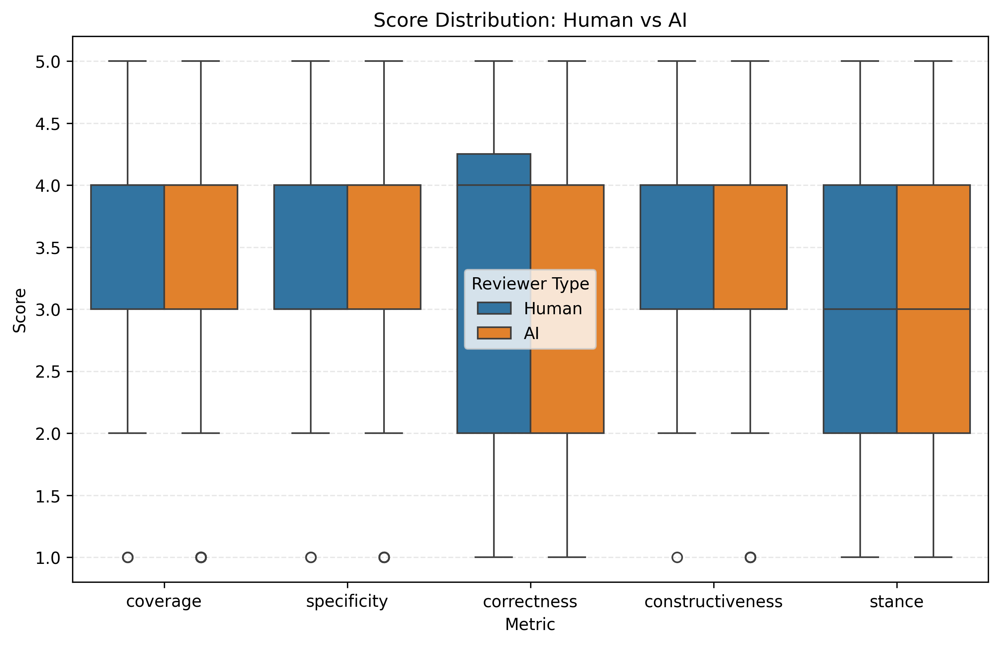
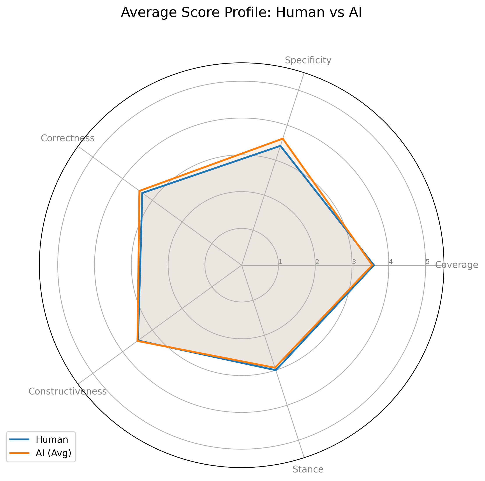
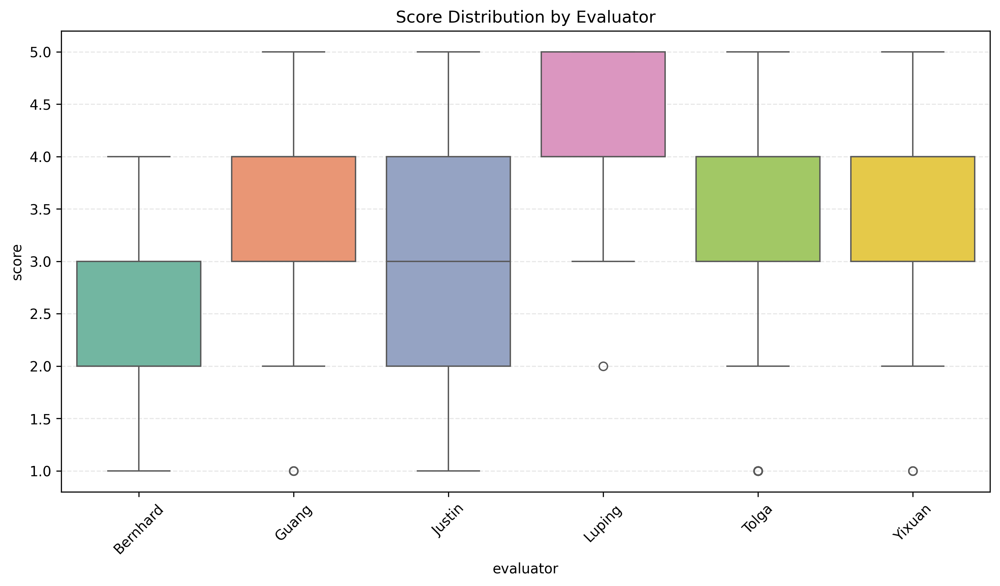
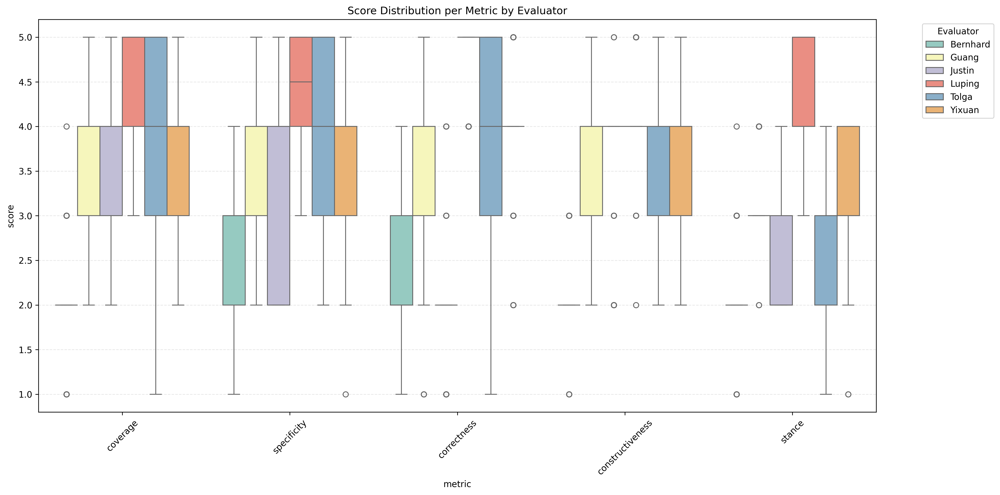
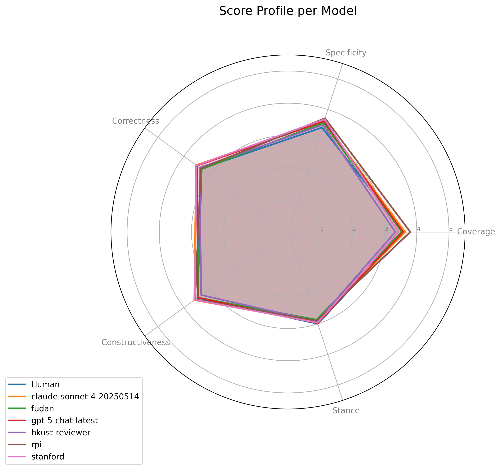
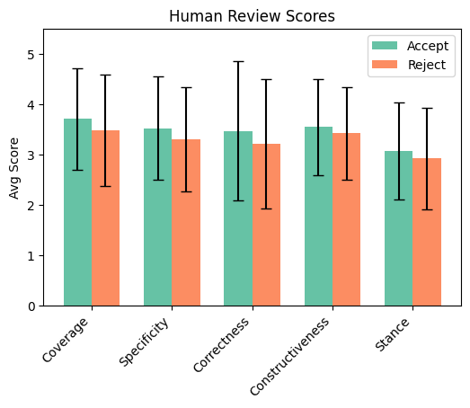
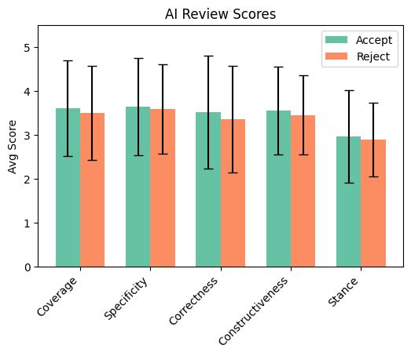

# AI Reviewer Evaluation Report
**Date:** Automated Analysis

## Introduction
This report presents a comprehensive evaluation of AI reviewers compared to human performance.

## Score Statistics

### Score Distributions

### Per-Evaluator Statistics

### Per-Evaluator per Metric Statistics

## Statistical Significance Tests

### Methodology
We confirm performance differences using Mann-Whitney U (unpaired), Wilcoxon Signed-Rank (paired), and assess variance equality with Levene's Test. Effect size is measured by Cliff's Delta.

### Global Analysis (Human vs All AI)
| Metric           | MW U (p)   |   Wilcoxon (p) |   Levene (p) |   Cliff's Delta |
|:-----------------|:-----------|---------------:|-------------:|----------------:|
| Coverage         | 0.7241     |         0.4175 |       0.8742 |          -0.018 |
| Specificity      | 0.0217*    |         0.2737 |       0.507  |           0.117 |
| Correctness      | 0.4835     |         0.6623 |       0.1881 |           0.036 |
| Constructiveness | 0.7039     |         0.9531 |       0.6165 |           0.019 |
| Stance           | 0.3827     |         0.2572 |       0.7488 |          -0.044 |

### Per-Model Analysis

#### Model: claude-sonnet-4-20250514
| Metric           |   MW U (p) |   Wilcoxon (p) |   Levene (p) |   Cliff's Delta |
|:-----------------|-----------:|---------------:|-------------:|----------------:|
| Coverage         |     0.8664 |         0.7985 |       0.798  |           0.014 |
| Specificity      |     0.1856 |         0.4165 |       0.7888 |           0.11  |
| Correctness      |     0.3529 |         0.5564 |       0.3437 |           0.078 |
| Constructiveness |     0.3735 |         0.4232 |       0.6627 |           0.072 |
| Stance           |     0.6614 |         0.3867 |       0.5408 |          -0.036 |

#### Model: fudan
| Metric           |   MW U (p) |   Wilcoxon (p) |   Levene (p) |   Cliff's Delta |
|:-----------------|-----------:|---------------:|-------------:|----------------:|
| Coverage         |     0.753  |         0.4057 |       0.3417 |          -0.026 |
| Specificity      |     0.2909 |         0.5735 |       0.4535 |           0.088 |
| Correctness      |     0.8901 |         0.3814 |       0.5545 |          -0.012 |
| Constructiveness |     0.99   |         0.651  |       0.8864 |          -0.001 |
| Stance           |     0.4624 |         0.114  |       0.6647 |          -0.06  |

#### Model: gpt-5-chat-latest
| Metric           |   MW U (p) |   Wilcoxon (p) |   Levene (p) |   Cliff's Delta |
|:-----------------|-----------:|---------------:|-------------:|----------------:|
| Coverage         |     0.9219 |         0.7408 |       0.9605 |          -0.008 |
| Specificity      |     0.1611 |         0.3515 |       0.7923 |           0.117 |
| Correctness      |     0.4839 |         0.4514 |       0.1563 |           0.059 |
| Constructiveness |     0.929  |         0.7883 |       0.6649 |          -0.007 |
| Stance           |     0.7482 |         0.6087 |       0.9569 |          -0.026 |

#### Model: hkust-reviewer
| Metric           |   MW U (p) | Wilcoxon (p)   |   Levene (p) |   Cliff's Delta |
|:-----------------|-----------:|:---------------|-------------:|----------------:|
| Coverage         |     0.127  | 0.0377*        |       0.9593 |          -0.127 |
| Specificity      |     0.5605 | 0.9413         |       0.8344 |           0.049 |
| Correctness      |     0.8403 | 0.9751         |       0.2537 |           0.017 |
| Constructiveness |     0.3489 | 0.1073         |       0.6724 |          -0.076 |
| Stance           |     0.528  | 0.3445         |       0.7068 |          -0.052 |

#### Model: rpi
| Metric           | MW U (p)   |   Wilcoxon (p) |   Levene (p) |   Cliff's Delta |
|:-----------------|:-----------|---------------:|-------------:|----------------:|
| Coverage         | 0.1246     |         0.1091 |       0.9605 |           0.128 |
| Specificity      | 0.0373*    |         0.1521 |       0.5647 |           0.173 |
| Correctness      | 0.9384     |         0.5887 |       0.8645 |           0.007 |
| Constructiveness | 0.4924     |         0.5881 |       0.6649 |           0.056 |
| Stance           | 0.4484     |         0.3147 |       0.1396 |          -0.062 |

#### Model: stanford
| Metric           | MW U (p)   |   Wilcoxon (p) |   Levene (p) |   Cliff's Delta |
|:-----------------|:-----------|---------------:|-------------:|----------------:|
| Coverage         | 0.2879     |         0.1849 |       0.5869 |          -0.088 |
| Specificity      | 0.0491*    |         0.2052 |       0.1317 |           0.163 |
| Correctness      | 0.4236     |         0.4547 |       0.1322 |           0.067 |
| Constructiveness | 0.3923     |         0.5681 |       0.3883 |           0.069 |
| Stance           | 0.7529     |         0.5875 |       0.3647 |          -0.026 |

## Turing Test Analysis (AI Detection)
Evaluators were asked to guess if the review was written by AI or Human. We present the confusion matrices below.
| Evaluator   |   Accuracy |   Precision |   Recall |       F1 |
|:------------|-----------:|------------:|---------:|---------:|
| Bernhard    |   0.666667 |    0.666667 | 1        | 0.8      |
| Guang       |   0.377778 |    0.535714 | 0.5      | 0.517241 |
| Justin      |   0.6      |    0.657895 | 0.833333 | 0.735294 |
| Luping      |   0.477778 |    0.740741 | 0.333333 | 0.45977  |
| Tolga       |   0.477778 |    0.666667 | 0.433333 | 0.525253 |
| Yixuan      |   0.566667 |    0.769231 | 0.5      | 0.606061 |
| Overall     |   0.527778 |    0.66055  | 0.6      | 0.628821 |

### Per-Evaluator Confusion Matrices

## Inter-Evaluator Agreement
Cohen's Kappa and Gwet's AC2 agreement between evaluators on review scores (discretized).

### Cohen's Kappa
| Evaluator   | Bernhard   | Guang   | Justin   | Luping   | Tolga   | Yixuan   |
|:------------|:-----------|:--------|:---------|:---------|:--------|:---------|
| Bernhard    | -          | -0.00   | -        | 0.00     | 0.03    | -        |
| Guang       | -0.00      | -       | -0.08    | -0.01    | -       | 0.26     |
| Justin      | -          | -0.08   | -        | -        | 0.13    | -0.06    |
| Luping      | 0.00       | -0.01   | -        | -        | -       | 0.23     |
| Tolga       | 0.03       | -       | 0.13     | -        | -       | 0.11     |
| Yixuan      | -          | 0.26    | -0.06    | 0.23     | 0.11    | -        |

### Gwet's AC2
Gwet's AC2 is often more robust to marginal imbalance and ordinal data.
| Evaluator   | Bernhard   | Guang   | Justin   | Luping   | Tolga   | Yixuan   |
|:------------|:-----------|:--------|:---------|:---------|:--------|:---------|
| Bernhard    | -          | -0.34   | -        | -0.53    | -0.23   | -        |
| Guang       | -0.34      | -       | -0.09    | -0.30    | -       | 0.26     |
| Justin      | -          | -0.09   | -        | -        | 0.07    | -0.15    |
| Luping      | -0.53      | -0.30   | -        | -        | -       | 0.16     |
| Tolga       | -0.23      | -       | 0.07     | -        | -       | 0.03     |
| Yixuan      | -          | 0.26    | -0.15    | 0.16     | 0.03    | -        |

## Breakdown wrt Accepted versus Rejected Papers
Analysis of review characteristics based on the final decision (Accept vs Reject).

### Scores and Differences

**Human Scores (Accept/Reject)**  

**AI Scores (Accept/Reject)**  

### Turing Test Confusion Matrices

### Additional Metrics
**AI Detection Metrics**  

**Dataset Distribution**  

# Appendix: Guide to Interpretations

## Interpreting Box Plots
The box plots in this report visualize the distribution of review scores.
* **Box**: Represents the Interquartile Range (IQR), spanning from the 25th percentile (Q1) to the 75th percentile (Q3). It contains the middle 50% of the data.
* **Median**: The line inside the box marks the median score (50th percentile).
* **Whiskers**: Extend from the box to the most extreme data points that are not considered outliers. Typically, this is 1.5 * IQR.
* **Empty Circles (Outliers)**: Points lying beyond the whiskers are plotted individually as empty circles. These represent outlier scores that are unusually high or low compared to the rest of the distribution.

## Statistical Methodology Details
This section explains the intuition and computation behind the statistical tests used.

### Mann-Whitney U Test
**Intuition**: A non-parametric test for independent samples (e.g., Human vs AI scores across different papers). It assesses whether one group's values are stochastically larger than the other's. It does not assume a normal distribution.
**Computation**: All observations are ranked together. The sum of ranks for each group is calculated. The U statistic is derived from these rank sums, comparing the number of times a value from one group precedes a value from the other.

### Wilcoxon Signed-Rank Test
**Intuition**: A non-parametric paired test used for per-model comparisons where we have matched scores (Human and AI reviewing the *same* paper). It tests if the distribution of differences is symmetric about zero.
**Computation**: Differences between paired scores (d_i = x_H - x_A) are calculated. Absolute differences |d_i| are ranked. Ranks are signed according to the sign of d_i. The test statistic W is the sum of positive ranks.

### Levene's Test
**Intuition**: Tests the null hypothesis that the variances (spread) of the two groups are equal (Homogeneity of Variance).
**Computation**: It performs an Analysis of Variance (ANOVA) on the absolute deviations of scores from their group means (or medians). A significant p-value suggests the groups have different consistency levels.

### Cliff's Delta
**Intuition**: An effect size measure quantifying the magnitude of difference between two groups. It represents the probability that a randomly selected value from one group is greater than one from the other, minus the reverse probability. values range from -1 to +1.
**Computation**:
delta = (#(x_H > x_A) - #(x_H < x_A)) / (n_H * n_A)
where x_H and x_A are scores from Human and AI groups respectively. 
Interpretation: |delta| < 0.147 (Negligible), < 0.33 (Small), < 0.474 (Medium), else (Large).

### Cohen's Kappa
**Intuition**: Measures inter-rater agreement for categorical items, correcting for agreement occurring by chance.
**Computation**:
kappa = (p_o - p_e) / (1 - p_e)
where p_o is the relative observed agreement, and p_e is the hypothetical probability of chance agreement based on marginal frequencies.

### Gwet's AC2
**Intuition**: An alternative to Cohen's Kappa specific for ordinal data and robust to marginal imbalance (paradoxes of Kappa). It estimates chance agreement based on average marginal probabilities.
